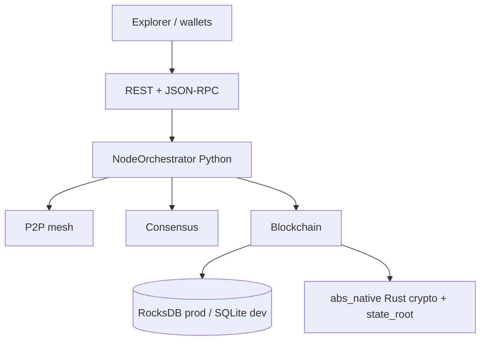

# Absolute Blockchain Ultimate Hybrid

**Hybrid Python + Rust L1 node** — production-profile mesh, RocksDB, REST/JSON-RPC explorer, native crypto (`abs_native`), EVM path, Docker/K8s deploy profiles.

[](https://www.python.org/)
[](native/abs_native)
[](LICENSE)
[](https://github.com/Gruver87/Absolute_Blockchain_Ultimate_Hybrid/actions/workflows/test.yml)
[](https://github.com/Gruver87/Absolute_Blockchain_Ultimate_Hybrid/actions/workflows/docker-prod-image.yml)
[](https://github.com/Gruver87/Absolute_Blockchain_Ultimate_Hybrid/actions/workflows/security-audit.yml)
[](CHANGELOG.md)
[](docs/EVIDENCE_MATRIX.md)
[](RELEASE_NOTES_v1.3.17.md)

**Repo:** [github.com/Gruver87/Absolute_Blockchain_Ultimate_Hybrid](https://github.com/Gruver87/Absolute_Blockchain_Ultimate_Hybrid) · **Default branch:** `master`  
**Author:** **ULADZIMIR DABRANSKI** (D.U.P.) · **Owner:** Gruver87

| | |
|---|---|
| **Release** | **v1.3.17** - [notes](RELEASE_NOTES_v1.3.17.md) — [CHANGELOG](CHANGELOG.md) |
| **Entry** | `python main.py` |
| **Dev chain** | `77777` |
| **Mainnet-v1 prep chain** | `778888` (prod profile — **not** a public mainnet) |
| **Native** | Rust/PyO3 `abs_native` (hashes, Merkle, state_root, secp256k1, EVM kernels) |
| **Evidence** | [docs/EVIDENCE_MATRIX.md](docs/EVIDENCE_MATRIX.md) — live mesh proofs only |

---

## Status at a glance (honest)

| Claim | Status | Proof |
|-------|--------|-------|
| Local / Docker devnet | **Proven** | `docker_devnet*.ps1`, CI |
| Prod-profile 3-node mesh (778888) | **Proven** | `docker_prod_3node.ps1`, ports `:18180–18182` |
| Failover + signed tx + EVM mempool on prod mesh | **Proven** | Jul 2026 evidence suite |
| **7h + 48h soak** | **PASS** | 48h: 2026-07-19→21 · `soak_report_48h.json` |
| Public mainnet / listed ABS / external audit | **Not claimed** | Gaps in [MAINNET_GAP_ANALYSIS](docs/MAINNET_GAP_ANALYSIS.md) |
| Bridge L1 cutover | **Off by design** on prod mesh | [BRIDGE_L1_MAINNET](docs/BRIDGE_L1_MAINNET.md) |

> **Not** a launched public mainnet. **Not** an investment product. ABS is an in-repo tokenomics model (221M cap), not a tradable listed asset. Do not put real funds on this stack without an independent audit.

---

## Why this repo is different

Most “blockchain” GitHub pages advertise features. This one separates **code that exists** from **operations that were measured**:

1. **Evidence matrix** — every major ops claim maps to a command + artifact ([EVIDENCE_MATRIX](docs/EVIDENCE_MATRIX.md)).
2. **Fail-closed prod profile** — secrets, native crypto, no simulator bridge, admin JWT, RPC API keys.
3. **48h soak under Docker** — completed with `fail_lines=0`; log rotation + WSL memory hardening after real OOM/daemon.json incidents.
4. **Hybrid honesty** — Python orchestrates; Rust owns deterministic hot paths; gaps (audit, public VPS, bridge cutover) are listed, not hidden.

---

## Docs map

| Doc | Purpose |
|-----|---------|
| [EVIDENCE_MATRIX](docs/EVIDENCE_MATRIX.md) | Proven vs not-proven (source of truth) |
| [MAINNET_GAP_ANALYSIS](docs/MAINNET_GAP_ANALYSIS.md) | Honest checklist to mainnet-v1 |
| [ARCHITECTURE](docs/ARCHITECTURE.md) | System design |
| [COMMANDS_REFERENCE](docs/COMMANDS_REFERENCE.md) | Operator commands |
| [PUBLIC_TESTNET](docs/PUBLIC_TESTNET.md) | Testnet plan (local seed proven; public URL not yet) |
| [STORAGE_ROCKSDB](docs/STORAGE_ROCKSDB.md) | Prod storage + DR |
| [BRIDGE_L1_MAINNET](docs/BRIDGE_L1_MAINNET.md) | Bridge cutover rules |
| [SECURITY](SECURITY.md) · [CONTRIBUTING](CONTRIBUTING.md) | Secrets policy · how to contribute |

---

## Snapshot maturity

| Area | Level | Verified |
|------|-------|----------|
| **L1 core** | Hardened R&D | Blocks, balances, burn, genesis, ECDSA txs, auto-mine ~12–15s |
| **REST + Explorer** | Solid | 288+ handlers, OpenAPI, Wave 61, SPA explorer |
| **P2P** | Verified | 2/3/5-node Docker; state_root; topology; rejoin |
| **TX / EVM on prod mesh** | Proven | Signed gossip + mempool deploy smoke (Jul 2026) |
| **Rust native** | Hybrid path | `abs_native` required in prod (`ABS_REQUIRE_NATIVE_CRYPTO`) |
| **Failover / soak** | **Proven** | Failover drill + **7h** + **48h PASS** |
| **Bridge** | Prep | Rust path in lab; **OFF** on prod mesh until cutover |
| **L2 / PQ / ZK modules** | R&D | Unit-tested; not mainnet Lightning/Plasma/audited SNARKs |
| **Public mainnet** | **Not launched** | External audit + validator ops + L1 cutover remaining |

**Quality gate:** CI badges · `.\scripts\check_hybrid_full.ps1` · **824+** tests (`pytest tests/ --collect-only`)

---

## Architecture



Full diagram: **[docs/ARCHITECTURE.md](docs/ARCHITECTURE.md)**

### Operator cheatsheet (prod mesh)

| Action | Command |
|--------|---------|
| Start / restore mesh | `.\scripts\docker_prod_3node.ps1 -SkipBuild -KeepVolumes` |
| Probe | `.\scripts\probe_prod_mesh.ps1` |
| Resilience | `.\scripts\prod_mesh_resilience_suite.ps1` |
| Soak 24h+ | `.\scripts\soak_monitor.ps1 -ProdMesh -Hours 48` |
| Industrial gate + soak | `python scripts/industrial_gate.py --min-soak-hours 48` |
| Evidence suite | `.\scripts\prod_evidence_suite.ps1` |
| Audit pack zip | `.\scripts\export_audit_pack.ps1` |

---

## Deployment modes

| What you run | Chain ID | Notes |
|--------------|----------|-------|
| `python main.py` | 77777 | Local solo / small mesh |
| `docker_devnet_5validator.ps1` | 77777 | 5-validator lab |
| `docker_prod_3node.ps1` | **778888** | Prod-profile mesh; bridge **OFF** |

Do **not** mix local `python main.py` with Docker on the same host ports.

```powershell
.\scripts\probe_mesh_nodes.ps1 -ProdMesh
```

---

## Quick start

### Requirements

- Python **3.10+** · Rust toolchain · Docker Desktop (for mesh) · Windows / Linux / macOS

```bash
git clone https://github.com/Gruver87/Absolute_Blockchain_Ultimate_Hybrid.git
cd Absolute_Blockchain_Ultimate_Hybrid
pip install -r requirements.txt
cp .env.example .env
cp wallet.example.json data/wallet.json
```

```powershell
.\scripts\build_native.ps1
.\scripts\build_bridge.ps1
.\scripts\check_hybrid_full.ps1
python main.py
```

Explorer: http://localhost:8080

Secrets only in `.env` — never commit. See [SECURITY.md](SECURITY.md).

### Prod 3-node mesh

```powershell
.\scripts\setup_prod_env.ps1   # once
.\scripts\docker_prod_3node.ps1
# later:
.\scripts\docker_prod_3node.ps1 -SkipBuild -KeepVolumes
```

| Node | Explorer |
|------|----------|
| mesh-1 | http://127.0.0.1:18180 |
| mesh-2 | http://127.0.0.1:18181 |
| mesh-3 | http://127.0.0.1:18182 |

Container logs are rotated (`50m × 3`) so long soaks do not fill the Docker VM disk.

---

## What ships in-tree

| Capability | Status | How |
|------------|--------|-----|
| Solo node + Explorer | Ready | `python main.py` |
| Docker 2/3/5-node lab | Ready | `docker_devnet*.ps1` |
| Prod 3-node mesh | Ready | `docker_prod_3node.ps1` |
| P2P / fork / bridge CI modes | Ready | `verify_p2p_ci.py` |
| Full local gate | Ready | `test_blockchain_full.ps1` / `monolith_gate.ps1` |
| Cross-chain bridge | Cutover-gated | OFF on prod 778888 until L1 contracts |
| Lightning / Plasma / WASM / Oracles / ZK / PQ | R&D modules | Unit-tested; not full mainnet products |

---

## Core L1 + P2P (Waves 47–63)

| Wave | Feature |
|------|---------|
| **47–50** | Receipts, metrics, address index, proposers, strict `state_root` |
| **52–56** | 3-node testnet, fork/slashing CI, consistency harness, multi-node proof, 5 validators |
| **57** | Deterministic proposer, finality quorum, reorg guard, mempool MEV |
| **58–60** | Fork CI, bridge relayer e2e, L1 RPC relayer proof |
| **61–63** | Topology / rejoin, Docker recovery gate, admin JWT lockdown |

```powershell
(Invoke-RestMethod http://localhost:8080/status).api_wave   # → 61
.\scripts\docker_devnet_3node.ps1
python scripts/verify_p2p_ci.py --mode devnet3 --wait 300
```

History: [CHANGELOG.md](CHANGELOG.md)

---

## Tokenomics (in-repo model)

| Param | Value |
|-------|-------|
| Symbol | **ABS** |
| Max supply | **221 000 000** |
| Founder (D.U.P.) | **17.4%** = 38 454 000 ABS |
| Ecosystem / Treasury / Staking / Mining | 10% / 10% / 12.6% / 50% until cap |

Code: `runtime/tokenomics.py` · `GET /tokenomics` — **not** a listed token.

---

## Production profile (fail-closed)

| Requirement | Enforcement |
|-------------|-------------|
| No public `auto_sign` | REST/RPC |
| Admin POST JWT | `JWT_ENFORCE_ADMIN` |
| RPC API keys | `RPC_API_KEY_REQUIRED` |
| No wildcard CORS | config validation |
| Rust bridge only | `BRIDGE_MODE=rust` |
| Native crypto required | `ABS_REQUIRE_NATIVE_CRYPTO` |
| L1 proof when bridge on | `BRIDGE_REQUIRE_L1_PROOF` |
| Config gate | `python scripts/prod_gate.py` |

---

## Operational evidence timeline (Jul 2026)

| When | What |
|------|------|
| Jul 12 | Failover, signed tx, EVM mempool, **7h soak PASS** |
| Jul 13–17 | Prod mesh hardening, P2P/TLS/resilience, industrial gates |
| Jul 17–18 | First 48h attempt interrupted (Docker OOM / corrupted `daemon.json`) |
| Jul 19–21 | Clean **48h soak PASS** after log rotation + Docker RAM headroom |
| Jul 21 | 48h soak PASS · **v1.2.85**–**v1.3.17** industrial hardening wave |

Details: [EVIDENCE_MATRIX](docs/EVIDENCE_MATRIX.md) · [RELEASE_NOTES_v1.3.17](RELEASE_NOTES_v1.3.17.md)

---

## License

MIT — see [LICENSE](LICENSE).

---

*Last update: 2026-07-21 — **v1.3.17** (never-probed wire honesty). Not a launched public mainnet.*
