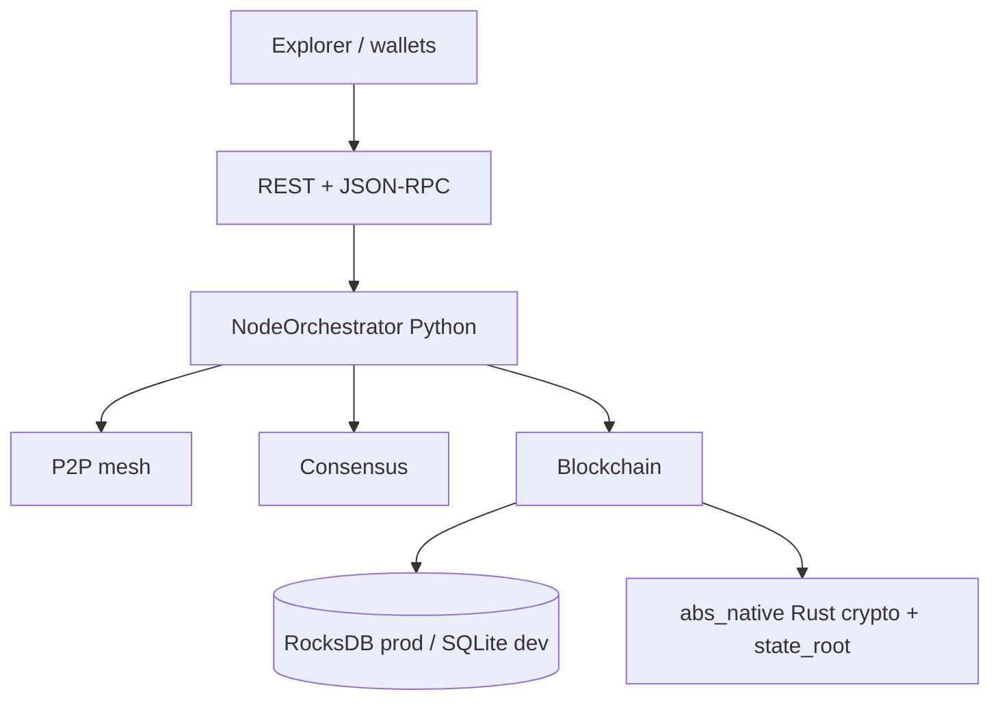

# Absolute Blockchain Ultimate Hybrid

> **Production-hardened hybrid Python + Rust blockchain node and devnet stack** — Python L1/P2P/REST orchestration with Rust/PyO3 native crypto kernels, Rust bridge path, ABS tokenomics model, Docker/Kubernetes deployment profiles.

[](https://www.python.org/)
[](LICENSE)
[](https://github.com/Gruver87/Absolute_Blockchain_Ultimate_Hybrid/actions/workflows/test.yml)
[](https://github.com/Gruver87/Absolute_Blockchain_Ultimate_Hybrid/actions/workflows/docker-prod-image.yml)
[](https://github.com/Gruver87/Absolute_Blockchain_Ultimate_Hybrid/actions/workflows/security-audit.yml)
[](CHANGELOG.md)
[](scripts/check_hybrid_full.ps1)
[](RELEASE_NOTES_v1.2.42.md)

**Repo:** [github.com/Gruver87/Absolute_Blockchain_Ultimate_Hybrid](https://github.com/Gruver87/Absolute_Blockchain_Ultimate_Hybrid) · **Branch:** `master`

**Author:** **ULADZIMIR DABRANSKI** (D.U.P.)<br>
**Project owner:** Gruver87

| Field | Value |
|-------|-------|
| **Version** | `1.2.0-industrial` (release **v1.2.42** L2 advanced modules + **v1.2.41** prod mesh evidence) |
| **Author** | **ULADZIMIR DABRANSKI** |
| **API Wave** | 61; check GET /status fields: `api_wave`, `core_real`, `p2p_sync_status` |
| **Entry point** | `python main.py` |
| **Storage** | SQLite or RocksDB (`db_engine` in config) |
| **Chain ID (dev)** | `77777` — Docker devnet / local default |
| **Chain ID (mainnet-v1 prep)** | `778888` — prod profile only; not a launched public mainnet |
| **Native layer** | Rust/PyO3 `abs_native`: SHA-256, Merkle, state_root, secp256k1, header/tx/block canonical hash, P2P chain validation, Keccak-256 |
| **Production gate** | `.\scripts\check_hybrid_full.ps1` / `bash scripts/check_hybrid_full.sh` |

| Docs | Link |
|------|------|
| Changelog | [CHANGELOG.md](CHANGELOG.md) |
| Architecture | [docs/ARCHITECTURE.md](docs/ARCHITECTURE.md) |
| Public testnet (plan) | [docs/PUBLIC_TESTNET.md](docs/PUBLIC_TESTNET.md) |
| Release notes | [v1.2.42](RELEASE_NOTES_v1.2.42.md) · [v1.2.41](RELEASE_NOTES_v1.2.41.md) · [v1.2.28](RELEASE_NOTES_v1.2.28.md) · [Evidence matrix](docs/EVIDENCE_MATRIX.md) |
| Mainnet gap (honest) | [docs/MAINNET_GAP_ANALYSIS.md](docs/MAINNET_GAP_ANALYSIS.md) |
| Bridge L1 cutover | [docs/BRIDGE_L1_MAINNET.md](docs/BRIDGE_L1_MAINNET.md) |
| Docker images (GHCR) | [docs/DOCKER_IMAGES.md](docs/DOCKER_IMAGES.md) |
| RocksDB storage | [docs/STORAGE_ROCKSDB.md](docs/STORAGE_ROCKSDB.md) |
| Incident response | [docs/INCIDENT_RESPONSE.md](docs/INCIDENT_RESPONSE.md) |
| Observability | [docs/OBSERVABILITY.md](docs/OBSERVABILITY.md) |
| Honest command reference | [docs/COMMANDS_REFERENCE.md](docs/COMMANDS_REFERENCE.md) |

---

## ⚠️ Disclaimer (read first)

| | |
|---|---|
| **What it is** | Production-hardened R&D blockchain node, local/devnet network stack, portfolio-grade protocol implementation |
| **What it is NOT** | Launched public mainnet, formally audited DeFi, listed token, investment product |
| **ABS token** | In-repo tokenomics model (221M cap) — **not** a tradable asset |
| **Security** | Stronger production gates are implemented; **external audit: not completed**; do **not** use for real funds without independent review |

**Evidence vs claims:** [docs/EVIDENCE_MATRIX.md](docs/EVIDENCE_MATRIX.md) — what live prod mesh runs have actually proven (Jul 2026).

---

## Snapshot

**Absolute Blockchain Ultimate Hybrid** looks like a **working R&D L1 / devnet stack** with a functioning 3-node production-profile mesh, state synchronization, RocksDB persistence, Rust crypto on consensus paths, automated CI/gates, and baseline ops automation (health watch, DR rehearsal, restart recovery). **Public mainnet-ready readiness is not proven** — see gaps below and [docs/EVIDENCE_MATRIX.md](docs/EVIDENCE_MATRIX.md).

| Area | Level | What is verified in-repo |
|------|-------|--------------------------|
| **L1 core** | 🟢 Hardened R&D implementation | Blocks, balances, 2% burn, genesis, ECDSA txs, auto-mining ~12–15s |
| **REST API** | 🟢 | 288+ route handlers, OpenAPI docs endpoint, API Wave 61, prod admin gates |
| **Web Explorer** | 🟢 | SPA on port 8080; 32 functional tabs |
| **P2P networking** | 🟢 Verified | 2 / 3 / 5-node Docker meshes; strict state root checks, topology, and rejoin APIs |
| **TX propagation** | 🟢 Prod proven | Signed gossip via `prod_signed_tx_smoke.py` — n2/n3 see tx on live prod mesh |
| **Multi-validator devnet** | 🟢 | 5 validators, proposer rotation, 3 miners + 2 attesters |
| **State consistency** | 🟢 | Cross-node harness + auto-repair (`/chain/consistency/*`) on live prod mesh |
| **Fork & slashing CI** | 🟢 | `/testnet/fork-status`, double-vote detection |
| **JSON-RPC** | 🟢 | eth_* subset on port 8545, API-key protection in prod |
| **Tokenomics model** | 🟢 | 221M ABS cap, founder D.U.P. 17.4% — enforced in code |
| **Rust native crypto** | 🟢 Hybrid path | PyO3 `abs_native`: SHA-256, Merkle, state_root, secp256k1, header/tx/block hash, P2P import validation, Keccak-256 |
| **EVM / Bridge** | 🟡 Mixed | **Live prod RPC deploy (mempool) proven** Jul 12; bridge OFF on prod mesh by design |
| **L2 advanced (Lightning / Plasma / WASM / Oracles / ZK)** | 🟡 Working R&D | HTLC + Merkle proofs + wasmtime ABI + oracle quorum + ZK balance proofs — **unit-tested**, SQLite persisted; **not** full mainnet Lightning/Plasma |
| **Failover / soak** | 🟡 Partial | **Failover + 7h soak proven**; **24–48h soak** in progress — see [EVIDENCE_MATRIX.md](docs/EVIDENCE_MATRIX.md) |
| **Production mainnet** | 🔴 Not launched | External audit, validator ops, L1 bridge cutover; prod profile is **preparation**, not live mainnet |

**Quality gate (Jul 2026):** CI badges above · local **`.\scripts\check_hybrid_full.ps1`** → native crypto + bridge smoke + pytest · **`746` tests** in suite (`pytest tests/ --collect-only`)

---

## Architecture (short)



Full diagram (prod vs dev modules): **[docs/ARCHITECTURE.md](docs/ARCHITECTURE.md)**  
Public testnet checklist (not live): **[docs/PUBLIC_TESTNET.md](docs/PUBLIC_TESTNET.md)**

### Storage & DR (prod mesh)

| Action | Command |
|--------|---------|
| Backup node1 | `.\scripts\backup_chainstore.ps1 -DockerMesh1` |
| DR rehearsal | `.\scripts\dr_restore_rehearsal.ps1 -DockerMesh1` |
| Restore | `python scripts/restore_chainstore.py --backup-dir ... --data-dir data --force --verify` |
| Health watch | `.\scripts\health_watch.ps1 -ProdMesh` (optional `$env:HEALTH_WEBHOOK_URL`) |
| Soak test (24h+) | `.\scripts\soak_monitor.ps1 -ProdMesh -Hours 24` — **must run to completion**; see [EVIDENCE_MATRIX.md](docs/EVIDENCE_MATRIX.md) |
| Industrial gate | `.\scripts\prod_mesh_full.ps1` or `test_blockchain_full.ps1 -ProdMeshFull` |
| Failover drill | `.\scripts\prod_mesh_failover.ps1` — **ops proof**: stop node2, verify blocks + rejoin |
| Signed tx (prod) | `python scripts/prod_signed_tx_smoke.py` — **not** covered by default mesh `SKIP: tx propagation` |
| Prod EVM (deploy + RPC storage) | `python scripts/prod_evm_smoke.py` — requires `RPC_API_KEYS` from `.env` |
| Full evidence suite | `.\scripts\prod_evidence_suite.ps1` — health + failover + signed tx + EVM |

---

## Deployment modes (read before interpreting Dashboard)

| What you run | Chain ID | Typical Dashboard | Bridge |
|--------------|----------|-------------------|--------|
| `python main.py` (dev `.env`) | 77777 | solo or 1 peer | ON if configured |
| `docker_devnet_5validator.ps1` | 77777 | peers 4/5, `aligned` | ON on node1 (`:8080`) |
| `python main.py` + prod `.env` | **778888** | often **solo** if no mesh | **OFF** by default (mainnet-v1 cutover) |
| `docker_prod_3node.ps1` | **778888** | peers ≥2, `aligned` | **OFF** until `-Bridge` lab |

**Common false alarm:** Dashboard on `:8080` shows `Peers 1/5 · single peer (dev)` while Docker mesh runs on `:8081`–`:8084` — you are viewing **one process**, not the mesh. Use:

```powershell
.\scripts\probe_mesh_nodes.ps1              # devnet5 ports
.\scripts\probe_mesh_nodes.ps1 -ProdMesh    # prod 3-node
```

Do **not** mix local `python main.py` with Docker on the same host ports (`:8080`, `:5000`, `:8545`).

---

## What you get out of the box

| Capability | Status | How to try |
|------------|--------|------------|
| Solo node + Explorer | ✅ | `python main.py` → http://localhost:8080 |
| Two-node local devnet | ✅ | `.\scripts\start_two_nodes.ps1` |
| Docker 2-node mesh | ✅ | `.\scripts\docker_devnet.ps1` |
| Docker 3-node testnet (Wave 52) | ✅ | `.\scripts\docker_devnet_3node.ps1` |
| Docker 5-validator devnet (Wave 55) | ✅ | `.\scripts\docker_devnet_5validator.ps1` |
| Prod 3-node mesh (mainnet-v1 prep) | ✅ | `.\scripts\docker_prod_3node.ps1` |
| Mesh / bridge probe | ✅ | `.\scripts\probe_mesh_nodes.ps1` |
| P2P sync verification | ✅ | `python scripts/verify_p2p_ci.py --mode devnet3` |
| Full project audit (one command) | ✅ | `.\scripts\test_blockchain_full.ps1` · monolith: `.\scripts\monolith_gate.ps1 -BridgeCutover` |
| Unit + integration tests | ✅ | `pytest tests/ -q` |
| Cross-chain bridge | 🟡 Cutover | **Dev:** rust path on node1. **Prod (778888):** `bridge_enabled=false` until L1 contracts; enable via `docker_prod.ps1 -Bridge` |
| NFT marketplace | ✅ Dev module | Persisted in SQLite |
| Lightning / Plasma / WASM / Will | 🟡 Working R&D | HTLC routing, Plasma Merkle proofs, wasmtime token/WASM ABI, CryptoWill — persisted in SQLite; prod-blocked where unsafe |
| Oracles (prices + quorum) | 🟡 Working R&D | Live feeds + reporter quorum median (`/oracles/reports/submit`, `/oracles/aggregate`); not decentralized oracle network |
| ZK proofs | 🟡 R&D module | Schnorr knowledge, range, balance ≥ amount — Fiat–Shamir; not audited snarks |
| Post-quantum crypto modules | ✅ R&D module | SPHINCS+, Kyber, Dilithium; private-key helper endpoints blocked in prod |

---

## Core L1 + P2P (Waves 47–63)

| Wave | Feature | Key endpoints |
|------|---------|---------------|
| **47** | TX receipts + chain metrics | `GET /chain/metrics`, `GET /tx/receipt/{hash}` |
| **48** | Address tx index | `GET /address/{addr}/activity`, `GET /address/{addr}/txs` |
| **49** | Block proposer audit | `GET /chain/proposers/stats`, `GET /chain/proposer/{addr}` |
| **50** | Strict `state_root` on P2P | `GET /chain/state-root/status` |
| **52** | **3-node testnet** | `GET /testnet/mesh`, `docker_devnet_3node.ps1` |
| **53** | **Fork / slashing CI** | `GET /testnet/fork-status`, `GET /slashing/events`, `--mode ci3` |
| **54** | **State consistency harness** | `GET /chain/consistency/harness`, `POST /chain/consistency/repair` |
| **58** | **Fork CI** | `POST /testnet/fork-exercise`, `--mode ci-fork` partition recovery |
| **59** | **Bridge relayer e2e** | `POST /bridge2/transfer` → RustBridge, L1 queue, `--mode ci-bridge` |
| **60** | **CI L1 RPC + relayer proof** | `GET /testnet/bridge-relayer-proof`, `--mode ci-bridge-relayer` |
| **61** | **Network hygiene + peer rejoin** | `GET /p2p/topology`, `POST /p2p/reconnect`, stable advertised peer ports |
| **62** | **Live Docker recovery gate** | `--mode devnet3-recovery`, `docker_devnet_3node.ps1 -Recovery`, restart/rejoin `state_root` convergence |
| **63** | **Admin repair endpoint lockdown** | `JWT_ENFORCE_ADMIN=true`, protected sync/reconnect/repair/fork drill POSTs |
| **57** | **Real core** | deterministic proposer, finality quorum, reorg guard, mempool MEV |
| **56** | **Multi-node proof** | `GET /testnet/multi-node-proof`, `POST /testnet/reorg-exercise`, 3-validator rotation |
| **55** | **5-validator devnet** | `GET /testnet/validators`, `docker_devnet_5validator.ps1` |

```powershell
(Invoke-RestMethod http://localhost:8080/status -UseBasicParsing).api_wave   # → 61
Invoke-RestMethod http://localhost:8080/p2p/topology -UseBasicParsing
Invoke-RestMethod http://localhost:8080/testnet/validators -UseBasicParsing
Invoke-RestMethod http://localhost:8080/chain/consistency/harness -UseBasicParsing

# 5-validator devnet (Wave 55):
.\scripts\docker_devnet_5validator.ps1
python scripts/verify_p2p_ci.py --mode devnet5

# 3-node testnet (Wave 61 verified):
.\scripts\docker_devnet_3node.ps1
python scripts/verify_p2p_ci.py --mode devnet3 --wait 300

# Industrial recovery gate (Wave 62):
.\scripts\docker_devnet_3node.ps1 -Recovery
python scripts/verify_p2p_ci.py --mode devnet3-recovery --wait 300

# Adversarial / bridge CI (no Docker):
python scripts/verify_p2p_ci.py --mode ci3
python scripts/verify_p2p_ci.py --mode ci-fork
python scripts/verify_p2p_ci.py --mode ci-bridge
python scripts/verify_p2p_ci.py --mode ci-bridge-relayer
# Dev-only convenience send (auto_sign is disabled in prod), then trace:
Invoke-RestMethod http://localhost:8080/tx/send -Method POST -ContentType application/json -Body '{"auto_sign":true,"to":"0x2222222222222222222222222222222222222222","value":0.01}'
Invoke-RestMethod http://localhost:8081/mempool -UseBasicParsing   # same tx on node2
Invoke-RestMethod http://localhost:8080/tx/trace/{hash} -UseBasicParsing
```

Full wave history (37–63): [CHANGELOG.md](CHANGELOG.md)

---

## Tokenomics (in-repo model)

| Param | Value |
|-------|-------|
| Symbol | **ABS** |
| Max supply | **221 000 000** |
| Founder | **Uladzimir Dabranski** (D.U.P.) — **17.4%** = 38 454 000 ABS |
| Ecosystem / Treasury | 10% + 10% (DAO unlock rules in code) |
| Staking pool | 12.6% (epoch release) |
| Mining emission | 50% until cap |

Config: `runtime/tokenomics.py` · API: `GET /tokenomics`

---

## Quick start

### Requirements

- Python **3.10+** (3.11–3.13 tested)
- Rust toolchain — required for `abs_native` PyO3 crypto acceleration and Rust bridge builds
- Windows / Linux / macOS
- Docker Desktop — optional, for `docker_devnet.ps1`

### Install

```bash
git clone https://github.com/Gruver87/Absolute_Blockchain_Ultimate_Hybrid.git
cd Absolute_Blockchain_Ultimate_Hybrid
pip install -r requirements.txt
cp .env.example .env
cp wallet.example.json data/wallet.json
```

Build the real Rust/PyO3 crypto extension for local high-throughput runs:

```powershell
.\scripts\build_native.ps1
.\scripts\build_bridge.ps1
.\scripts\check_hybrid_full.ps1
```

Linux/macOS:

```bash
bash scripts/build_native.sh
bash scripts/build_bridge.sh
bash scripts/check_hybrid_full.sh
```

The `abs_native` extension accelerates deterministic consensus kernels behind
the existing Python API: SHA-256, Merkle roots/proofs, and the canonical SQLite
account `state_root`, plus secp256k1 ECDSA verification for signed transaction
validation. Production profile sets `ABS_REQUIRE_NATIVE_CRYPTO=true` so the node
fails closed when the native wheel is not installed.

Secrets (`BRIDGE_ORACLE_SECRET`, `TELEGRAM_BOT_TOKEN`, RPC keys) — **only in `.env`**, never commit.

### Production Profile

The production profile is fail-closed by default. It requires explicit secrets and real L1 bridge configuration before startup:

| Requirement | Enforced by |
|-------------|-------------|
| Signed transactions only; no public `auto_sign` | REST/RPC handlers |
| Admin POST protection | `JWT_SECRET`, `JWT_ENFORCE_ADMIN=true` |
| JSON-RPC protection | `RPC_API_KEY_REQUIRED=true`, `RPC_API_KEYS` |
| No wildcard/localhost CORS | `CORS_ORIGINS` validation |
| Rust bridge only; no simulator fallback | `BRIDGE_MODE=rust`, `RustBridge` runtime |
| Native crypto required | `ABS_REQUIRE_NATIVE_CRYPTO=true`, `abs_native` PyO3 wheel |
| Required L1 proof path | `BRIDGE_REQUIRE_L1_PROOF=true`, `ETH_RPC_URL` / `BSC_RPC_URL` / `POLYGON_RPC_URL` |
| Dev/offchain modules disabled | `feature_*` prod defaults and `/features` API |
| Production config gate | `python scripts/prod_gate.py` |

Start production only after generating real secrets and mounting `data/wallet.json`:

```powershell
# Set JWT_SECRET to a generated long value.
# Set RPC_API_KEYS to one or more generated API keys.
# Set BRIDGE_ORACLE_SECRET to a generated long value.
# Set CORS_ORIGINS to your real explorer origin.
# Set ETH_RPC_URL to your real Ethereum RPC endpoint.
.\scripts\docker_prod.ps1
```

This is still **not** a public audited mainnet by itself. Before real funds or public validators, run an independent security audit, operate external L1 RPC infrastructure, deploy validator/key management, and test an actual multi-node environment.

### Prod 3-node mesh (mainnet-v1 prep)

Requires `.env` from `.\scripts\setup_prod_env.ps1` and ceremony keys in `data\ceremony_keys`.

```powershell
# First run (BuildKit + full image build, ~2–5 min)
$env:DOCKER_BUILDKIT = "1"
.\scripts\docker_prod_3node.ps1

# Repeat start (existing image, keep RocksDB volumes)
.\scripts\docker_prod_3node.ps1 -SkipBuild -KeepVolumes -NoCloneDb

# Use CI-built image from GHCR (after Actions workflow succeeds on master)
.\scripts\docker_prod_3node.ps1 -PullLatest -KeepVolumes -NoCloneDb

# Or one-liner
.\scripts\quick_restore.ps1 -KeepData

# Full reset (wipe volumes + rebuild)
docker compose -p abs-prod-mesh3 -f docker-compose.prod.3node.yml down -v
.\scripts\docker_prod_3node.ps1
```

| Node | Explorer | RPC |
|------|----------|-----|
| mesh-1 | http://127.0.0.1:18180 | :18545 |
| mesh-2 | http://127.0.0.1:18181 | :18546 |
| mesh-3 | http://127.0.0.1:18182 | :18547 |

```powershell
.\scripts\probe_mesh_nodes.ps1 -ProdMesh
Invoke-RestMethod http://127.0.0.1:18180/chain/consistency/harness
docker compose -f docker-compose.observability.yml up -d   # Prometheus :9090, Grafana :3000

# Backup prod mesh node1 (RocksDB checkpoint)
.\scripts\backup_chainstore.ps1 -DockerMesh1
# See docs/STORAGE_ROCKSDB.md for restore + DR drills
```

### Run

```bash
python main.py
```

| Service | URL |
|---------|-----|
| Explorer + REST | http://localhost:8080 |
| L2 dashboard | http://localhost:8080/l2/status |
| JSON-RPC | http://localhost:8545 |
| WebSocket | ws://localhost:8766 |
| P2P | `:5000` |

### Two nodes (P2P)

```powershell
.\scripts\stop_node.ps1
.\scripts\start_two_nodes.ps1 -RustBridge -Fresh    # :8080 + :8081

# or Docker:
.\scripts\docker_devnet.ps1 -RustBridge
```

Expected when healthy:

```
OK: peers n1=1 n2=1 heights X / X state_consistent=True state_roots_match=True
api_wave=61
```

### Full audit (recommended before release)

Single script — native crypto + bridge smoke, secrets scan, production/industrial/mainnet gates, bridge cutover preflight, full pytest, optional live API/P2P/Docker:

```powershell
# Full gate (builds abs_native + bridge if needed)
.\scripts\test_blockchain_full.ps1

# Faster local audit (skip native wheel rebuild)
.\scripts\check_everything.ps1

# Optional live / P2P / Docker / Prod mesh:
.\scripts\test_blockchain_full.ps1 -Live -P2P -Docker
.\scripts\test_blockchain_full.ps1 -ProdMesh
.\scripts\test_blockchain_full.ps1 -ProdMeshFull -ProdMeshSpawn -RecordEvidence
.\scripts\prod_mesh_full.ps1
# Reports: data/full_audit_report.json, data/mainnet_readiness.json, data/industrial_gate.json
```

### Verify

```powershell
pytest tests/ -q
pytest tests/unit/ -q
python scripts/verify_p2p_ci.py --mode devnet3 --wait 300
python scripts/verify_p2p_ci.py --mode devnet5
.\scripts\probe_mesh_nodes.ps1
curl.exe http://localhost:8080/status
curl.exe http://localhost:8080/bridge/status
curl.exe http://localhost:8080/features
```

---

## Architecture (short)

```
main.py → NodeOrchestrator
├── core/blockchain.py      # L1 blocks, txs, state_root
├── storage/database.py     # SQLite (L1 + L2 tables)
├── api/http.py             # REST + explorer backend
├── consensus/              # PoS adapter, slashing, finality
├── execution/              # VM, state engine, EVM adapter
├── features/               # L2, NFT, oracles, reorg, MEV…
├── network/p2p_node.py     # TCP gossip, sync, state_root wire
└── web/explorer/           # Browser UI
```

Details: [docs/ARCHITECTURE.md](docs/ARCHITECTURE.md) · Honest feature list: [docs/ALL_COMMANDS.txt](docs/ALL_COMMANDS.txt) Part 0

---

## API cheat sheet

| Method | Path | Purpose |
|--------|------|---------|
| GET | `/status` | `api_wave`, peers, bridge, flags |
| GET | `/native/crypto` | Rust/PyO3 native crypto availability, self-test, kernels |
| GET | `/sync/status` | heights, `state_consistent`, policy |
| GET | `/chain/metrics` | block time, tx/receipt/proposer counts |
| GET | `/chain/state-root/status` | roots vs peers, mismatches |
| GET | `/address/{addr}/activity` | balance, blocks_proposed, tx counts |
| GET | `/chain/proposer/{addr}` | proposer audit detail |
| GET | `/l2/status` | Lightning, Plasma, NFT, WASM… |
| POST | `/lightning/htlc/add` | HTLC lock on channel |
| POST | `/lightning/route` | Multi-hop HTLC payment |
| GET | `/plasma/proof` | Merkle inclusion proof (`block_id`, `tx_hash`) |
| POST | `/oracles/aggregate` | Median quorum from reporter submissions |
| GET | `/zk/info` | ZK module capabilities (R&D tier) |
| GET | `/features` | modules + persisted flags |
| GET | `/tokenomics` | supply model |
| POST | `/bridge/dev-confirm-pending` | dev only |

Full list: `api/http.py`, `/docs`, `docs/ALL_COMMANDS.txt`

---

## Troubleshooting

| Issue | Fix |
|-------|-----|
| Connection closed right after Docker up | Wait for `/status` or run `docker_devnet.ps1` |
| `api_wave` &lt; 60 in Docker | `docker compose -f docker-compose.devnet-rust.yml build --no-cache node1` + recreate |
| Ports busy / solo while mesh expected | `.\scripts\stop_node.ps1`; do not run local `main.py` on same ports as Docker |
| Dashboard `Bridge off` on prod | **Intentional** — mainnet-v1 cutover; see `bridge_disabled_reason` in `/status` |
| Two networks on one machine | chain 77777 (Docker :8081+) vs 778888 (local prod :8080) — use `probe_mesh_nodes.ps1` |
| Docker not running | Start Docker Desktop |

---

## Contributing

⭐ Star · 🍴 Fork · 🐛 Issues · 🔧 PRs — see [CONTRIBUTING.md](CONTRIBUTING.md)

---

## Author

**Uladzimir Dabranski** (D.U.P.)

- GitHub: [@Gruver87](https://github.com/Gruver87)
- Email: gruverpetrov@gmail.com

---

## License

[MIT](LICENSE) — free for learning and forks. **No warranty.** See [DISCLAIMER.md](DISCLAIMER.md).

---

*Last update: July 2026 — **v1.2.42**: working L2 modules (Lightning HTLC, Plasma Merkle, WASM, Oracle quorum, ZK); **v1.2.41**: prod mesh fork heal + live evidence PASS; see [docs/EVIDENCE_MATRIX.md](docs/EVIDENCE_MATRIX.md).*
