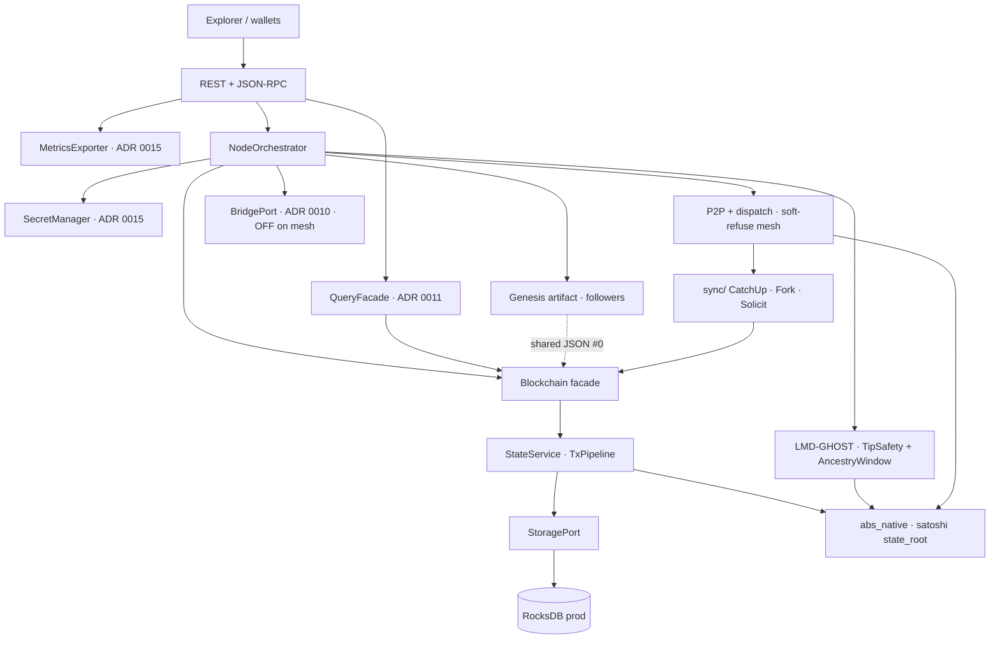

# Absolute Blockchain Ultimate Hybrid


**Hybrid Python + Rust L1 node** for local prod-profile mesh and evidence-first R&D. **Not** a launched public mainnet.

[](https://github.com/Gruver87/Absolute_Blockchain_Ultimate_Hybrid/releases)
[](LICENSE)
[](https://github.com/Gruver87/Absolute_Blockchain_Ultimate_Hybrid/actions/workflows/test.yml)
[](https://github.com/Gruver87/Absolute_Blockchain_Ultimate_Hybrid/actions/workflows/docker-prod-image.yml)
[](https://github.com/Gruver87/Absolute_Blockchain_Ultimate_Hybrid/actions/workflows/security-audit.yml)

## Start in 60 seconds

```bash
git clone https://github.com/Gruver87/Absolute_Blockchain_Ultimate_Hybrid.git
cd Absolute_Blockchain_Ultimate_Hybrid
pip install -r requirements.txt && cp .env.example .env
```

| OS | Build native | Self-check | Run |
|----|--------------|------------|-----|
| **Linux / macOS** | `make build` | `make test-quick` | `python main.py` |
| **Windows** | `.\scripts\build_native.ps1` | `.\scripts\operator_verify.ps1 -SkipNativeBuild` | `python main.py` |

Explorer: http://localhost:8080 · Mesh: `make mesh-up` or `.\scripts\docker_prod_3node.ps1`

**Skimmer:** [AT_A_GLANCE](docs/AT_A_GLANCE.md) · **Gaps:** [MAINNET_GAP_ANALYSIS](docs/MAINNET_GAP_ANALYSIS.md) · **Release:** [CHANGELOG](CHANGELOG.md)

---

## Proven vs not

| | Status | Proof |
|---|--------|-------|
| Docker / local mesh bring-up | **Proven** | CI · `docker_prod_3node` |
| 3-node prod-profile (`778888`) chain sync | **Proven** | shared genesis artifact · Path A catch-up |
| Mesh `/health/ready` (stable peers) | **Wave A local PASS** | `ready-check` ×3 · dual-dial ownership |
| Failover + signed tx + EVM on mesh | **Proven** | Jul 2026 suite |
| **48h soak** | **PASS** | `logs/soak_report_48h.json` |
| Public mainnet / listed ABS / external audit | **No** | [gaps](docs/MAINNET_GAP_ANALYSIS.md) |
| Bridge on live mesh | **OFF** | by design until L1 cutover |

> Not an investment product. ABS = in-repo tokenomics (221M), not a listed asset. No real funds without independent audit.

**Jump:** [Layout](#repo-layout-skimmers) · [Architecture](#architecture) · [Ops](#operator-cheatsheet) · [Docs](#docs-map) · [Contribute](CONTRIBUTING.md) · [Support](SUPPORT.md)

---

## Repo layout (skimmers)

```text
native/abs_native/   Rust crypto · Rocks · EVM kernels (PyO3)  ← Cargo.toml here
network/             P2P TCP + dispatch + catchup/fork adapters
sync/                CatchUp Path A · ForkReconcile · SolicitHub
storage/             StoragePort · RocksDB adapter · open_storage
core/                Blockchain facade · StateService · TxPipeline
api/                 REST + JSON-RPC · QueryFacade (ADR 0011)
consensus/           LMD-GHOST (forest-deterministic) + finality
secret_mgmt/         SecretManagerPort (ADR 0015)
observability/       MetricsExporterPort · Prometheus (ADR 0015)
docs/adr/            boundaries 0001–0016
docs/sprouts/        ADR 0016 profiles (App · Bridge · L2 · Shard · EVM)
scripts/             gates · mesh · soak · DR
Makefile             make build | test-quick | test-gate | mesh-up
```

---

## Why different (3 lines)

1. **Evidence over marketing** — claims map to commands + artifacts ([EVIDENCE_MATRIX](docs/EVIDENCE_MATRIX.md)).
2. **Fail-closed prod profile** — native crypto required, bridge OFF on mesh, admin JWT / API keys.
3. **Hybrid honesty** — Python orchestrates; Rust owns hot paths; gaps listed, not hidden.

---

## Docs map

| Need | Open |
|------|------|
| Proven vs not | [EVIDENCE_MATRIX](docs/EVIDENCE_MATRIX.md) |
| One-screen card | [AT_A_GLANCE](docs/AT_A_GLANCE.md) |
| Path to mainnet-v1 | [MAINNET_GAP_ANALYSIS](docs/MAINNET_GAP_ANALYSIS.md) |
| System design | [ARCHITECTURE](docs/ARCHITECTURE.md) |
| Operator commands | [COMMANDS_REFERENCE](docs/COMMANDS_REFERENCE.md) · [ALL_COMMANDS](docs/ALL_COMMANDS.txt) |
| Security / contribute | [SECURITY](SECURITY.md) · [CONTRIBUTING](CONTRIBUTING.md) · [SUPPORT](SUPPORT.md) |
| Audits / releasing | [AUDITS](docs/AUDITS.md) · [RELEASING](docs/RELEASING.md) · [REPO_PROFESSIONAL](docs/REPO_PROFESSIONAL.md) |
| GitHub About paste | [REPO_PROFILE](.github/REPO_PROFILE.md) |

---

## Snapshot maturity

| Area | Level | Verified |
|------|-------|----------|
| **L1 core** | Hardened R&D | Blocks, balances, burn, genesis, ECDSA, auto-mine |
| **REST + Explorer** | Solid | OpenAPI, Wave 61, SPA |
| **P2P** | Verified / Partial ready | Docker sync + CI; TLS session churn open |
| **TX / EVM on prod mesh** | Proven | Signed gossip + mempool deploy |
| **Rust native** | Hybrid path | `ABS_REQUIRE_NATIVE_CRYPTO` in prod |
| **Failover / soak** | **Proven** | 7h + **48h PASS** |
| **Bridge** | Ports isolated (ADR 0010) | OFF on prod mesh until L1 cutover |
| **RPC / Query** | Typed QueryFacade (ADR 0011) | DoS caps · no raw DB from handlers |
| **Secrets / metrics** | SecretManager + exporter (ADR 0015) | Env/K8s/Vault · `/metrics` snapshot |
| **Shutdown / ready** | Graceful stop (ADR 0014) | SIGTERM · deep `/health/ready` |
| **Public mainnet** | **Not launched** | Audit + ops + L1 cutover remaining |

**Quality gate:** CI · `make test-quick` / `check_all.ps1` · **2100+** tests collected

---

## Architecture


```mermaid
flowchart TB
  EX["Explorer / wallets"] --> API["REST + JSON-RPC"]
  API --> QF["QueryFacade · ADR 0011"]
  API --> MET["MetricsExporter · ADR 0015"]
  API --> ORCH["NodeOrchestrator"]
  ORCH --> SM["SecretManager · ADR 0015"]
  ORCH --> P2P["P2P + dispatch · soft-refuse mesh"]
  ORCH --> CONS["LMD-GHOST · TipSafety + AncestryWindow"]
  ORCH --> BC["Blockchain facade"]
  ORCH --> BR["BridgePort · ADR 0010 · OFF on mesh"]
  ORCH --> GEN["Genesis artifact · followers"]
  QF --> BC
  P2P --> SYNC["sync/ CatchUp · Fork · Solicit"]
  GEN -.->|shared JSON #0| BC
  SYNC --> BC
  BC --> SS["StateService · TxPipeline"]
  SS --> SP["StoragePort"]
  SP --> ROCKS[("RocksDB prod")]
  SS --> RUST["abs_native · satoshi state_root"]
  CONS --> RUST
  P2P --> RUST
```

Ports & honesty: **[docs/ARCHITECTURE.md](docs/ARCHITECTURE.md)** · ADRs **[0001–0016](docs/adr/)** · sprouts **[docs/sprouts/](docs/sprouts/)** · DR **[DISASTER_RECOVERY](docs/DISASTER_RECOVERY.md)**

### Operator cheatsheet

| Action | Windows | Linux/macOS |
|--------|---------|-------------|
| Self-check | `.\scripts\check_all.ps1` | `make test-quick` |
| Start mesh | `.\scripts\docker_prod_3node.ps1 -SkipBuild -KeepVolumes` | `make mesh-up` |
| Probe | `.\scripts\probe_prod_mesh.ps1` | same script via `pwsh` / docs |
| Soak 48h | `.\scripts\soak_monitor.ps1 -ProdMesh -Hours 48` | same |
| Industrial gate | `python scripts/industrial_gate.py --min-soak-hours 48` | same |

---

## Deployment modes

| What you run | Chain ID | Notes |
|--------------|----------|-------|
| `python main.py` | 77777 | Local solo |
| `docker_devnet_*.ps1` | 77777 | Lab mesh |
| `docker_prod_3node` / `make mesh-up` | **778888** | Prod-profile; bridge **OFF** |

Do **not** mix local `main.py` with Docker on the same host ports.

### Prod mesh explorers

| Node | URL |
|------|-----|
| mesh-1 | http://127.0.0.1:18180 |
| mesh-2 | http://127.0.0.1:18181 |
| mesh-3 | http://127.0.0.1:18182 |

---

## What ships in-tree

| Capability | Status |
|------------|--------|
| Solo node + Explorer | Ready |
| Docker 2/3/5-node lab | Ready |
| Prod 3-node mesh bring-up | Ready (`778888`; bridge OFF) |
| Prod mesh `/health/ready` green | Wave A local PASS (`ready-check` ×3) |
| P2P / fork CI | Ready |
| Unified self-check | Ready (`check_all` / `make`) |
| Cross-chain bridge | Cutover-gated (OFF on 778888) |
| Lightning / Plasma / WASM / ZK / PQ | R&D modules only |

---

## Tokenomics (in-repo model)

| Param | Value |
|-------|-------|
| Symbol | **ABS** |
| Max supply | **221 000 000** |
| Founder (D.U.P.) | **17.4%** |

Code: `runtime/tokenomics.py` · `GET /tokenomics` — **not** a listed token.

---

## Production profile (fail-closed)

| Requirement | Enforcement |
|-------------|-------------|
| No public `auto_sign` | REST/RPC |
| Admin POST JWT | `JWT_ENFORCE_ADMIN` |
| RPC API keys | `RPC_API_KEY_REQUIRED` |
| Native crypto | `ABS_REQUIRE_NATIVE_CRYPTO` |
| Bridge | OFF on live mesh until audited L1 |
| Config gate | `python scripts/prod_gate.py` |

---

## Evidence timeline (Jul 2026)

| When | What |
|------|------|
| Jul 12 | Failover, signed tx, EVM, **7h soak PASS** |
| Jul 19–21 | **48h soak PASS** |
| Jul 21–26 | Industrial **v1.3.65–v1.3.146** + professional repo surface (Dependabot/SBOM/SUPPORT) |
| Jul 29 | **v1.3.206** Tip-safety (enforce) + P2P transport boundary + application dispatcher |
| Jul 30 | **ADR 0010–0015** BridgePort · QueryFacade · Chaos · Graceful shutdown · Observability/SecretManager |
| Aug 1 | **ADR 0016** Feature sprouts / profiles · tip AncestryWindow · NFT port · sandbox/shard labs |
| Jul 30 | **v1.3.1338-deterministic-core** satoshi state domain + forest-stable LMD-GHOST + QueryPort honesty |

Ledger: [EVIDENCE_MATRIX](docs/EVIDENCE_MATRIX.md)

---

## Star / contribute

1. **Star** · **Watch → Releases** (`v1.3.x`)
2. Issues with evidence (`data/check_all.json`) — [CONTRIBUTING.md](CONTRIBUTING.md)
3. PRs to **`master`** (real process — no fake history)

---

## License

MIT — [LICENSE](LICENSE)

---

*Author: ULADZIMIR DABRANSKI (D.U.P.) · Owner: [Gruver87](https://github.com/Gruver87) · Default branch: `master`*  
*Last update: 2026-08-01 — **ADR 0016** feature sprouts/profiles on industrial L1 core (ADR 0001–0015). Not a launched public mainnet.*
