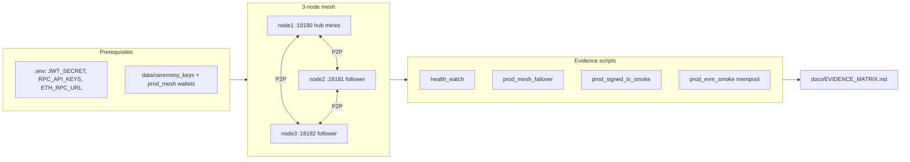
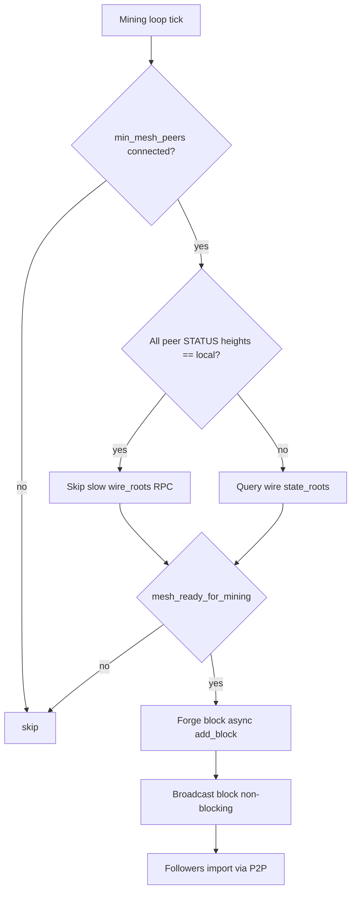

# Release v1.2.27 — prod mesh mining gate + cross-node EVM evidence

**Date:** 2026-07-12

## Summary

Fixes that unblock **continuous mining** on the 3-node prod mesh (chain `778888`) and enable **honest cross-node EVM evidence** via mempool deploy (not direct `/contract/deploy`).

**Live proof (local Docker mesh, Jul 12 evening):**

- Mempool signed deploy mined in block #6
- `eth_getStorageAt` slot0 = 1 on all three RPC ports (:18546–:18548)
- Mesh aligned: same height + `state_root` on :18180–:18182

**Not claimed:** public mainnet, 24–48h soak, external audit.

---

## What changed

| Area | Fix |
|------|-----|
| `runtime/mesh_mining.py` | STATUS peer heights as fallback; ignore stale wire state-root responses |
| `network/p2p_node.py` | Parallel peer state-root RPC; shorter per-peer timeout |
| `sync/sync_engine.py` | Do not flag mismatch while peer is catching up |
| `main.py` | Non-blocking P2P broadcast; `add_block` via `asyncio.to_thread`; resync before mining gate |
| `blockchain/tx_validator.py` | Allow `amount=0` for EVM deploy txs |
| `scripts/prod_evm_smoke.py` | Mempool deploy only; mesh alignment wait; no silent direct-deploy fallback |
| `scripts/verify_p2p_ci.py` | Mint admin JWT from `JWT_SECRET` when prod `/auth/token` is disabled |

---

## Architecture — prod mesh verification (honest)



---

## Mining gate — when hub forges the next block



---

## How to verify (copy-paste)

### 1. Build and start prod mesh

```powershell
.\scripts\setup_prod_env.ps1   # once: real ETH_RPC_URL + secrets
.\scripts\docker_prod_3node.ps1   # WITH build after code changes
```

Wait until all three HTTP ports respond and heights match:

```powershell
python -c "import sys; sys.path.insert(0,'scripts'); from verify_p2p_ci import _api
for p in (18180,18181,18182):
 s=_api(f'http://127.0.0.1:{p}/status'); print(p, s['height'], s['state_root'][:16], s.get('state_consistent'))"
```

### 2. Cross-node EVM (strict — mempool only)

From host (needs `.env` JWT + RPC keys):

```powershell
python scripts/prod_evm_smoke.py
```

Or inside hub container (secrets already in env):

```powershell
docker exec abs-prod-mesh3-node1-1 python scripts/prod_evm_smoke.py `
  --url1 http://127.0.0.1:8080 --url2 http://abs-prod-mesh-2:8080 --url3 http://abs-prod-mesh-3:8080 `
  --rpc1 http://127.0.0.1:8545 --rpc2 http://abs-prod-mesh-2:8545 --rpc3 http://abs-prod-mesh-3:8545 `
  --wallet /app/data/wallet.json
```

**Expected:** `OK: prod EVM deploy + storage on all RPC nodes`

**Do not use** `/contract/deploy` without mempool on prod mesh — it mutates node1 only and splits `state_root`.

### 3. Full evidence suite

```powershell
.\scripts\prod_evidence_suite.ps1
```

### 4. Long soak (not yet 48h proven)

```powershell
.\scripts\soak_monitor.ps1 -ProdMesh -Hours 48 -IntervalSec 300
```

Check `logs/soak_report.json`: `passed=true`, `failures=0`, runtime ≈ hours × 3600 s.

---

## Unit tests

```powershell
pytest tests/unit/test_mesh_mining_ready.py tests/unit/test_evm_prod_deploy_salt.py -q
```

---

## Known gaps (still open)

| Gap | Status |
|-----|--------|
| 24–48h soak | 7h passed; 48h not run yet |
| External audit | Checklist only |
| Public testnet VPS | Templates exist; no production DNS |
| `testnet_readiness` | Re-run recommended after this release |

See [docs/EVIDENCE_MATRIX.md](docs/EVIDENCE_MATRIX.md).
