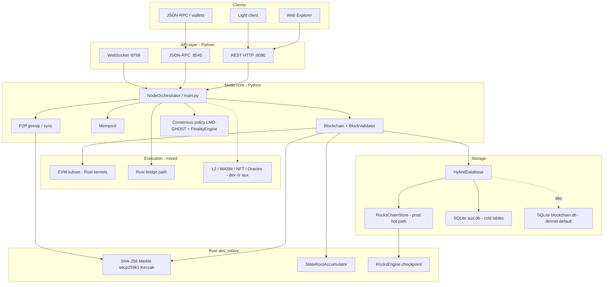
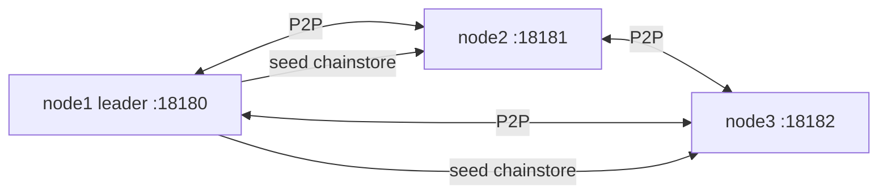

# Architecture (honest overview)

**Updated:** 2026-07-05  
**Scope:** Absolute Blockchain Ultimate Hybrid — devnet + mainnet-v1 **prep**, not a launched public mainnet.

---

## One-line summary

**Python** orchestrates the node (P2P, REST/RPC, consensus policy, deployment). **Rust/PyO3** (`abs_native`) accelerates deterministic crypto, state roots, RocksDB engine, and EVM kernels. **Prod** stores the hot path in **RocksDB**; dev modules may stay in SQLite aux or are blocked by prod gate.

---

## Layer diagram



Solid lines = **prod-relevant hot path**. Dotted = **devnet / optional / blocked in prod profile**.

---

## What runs where

| Component | Language | Prod (778888 prep) | Dev (77777) |
|-----------|----------|-------------------|-------------|
| REST / RPC / WS | Python | Yes | Yes |
| P2P mesh | Python | Yes | Yes |
| Consensus policy | Python | Unified LMD-GHOST | Parallel/auto |
| Block apply + burn | Python | Yes | Yes |
| State root | Rust PyO3 | Required | Required |
| Canonical hashing | Rust PyO3 | Required | Required |
| Chain storage hot path | RocksDB via Rust engine | **Required** | SQLite default |
| Bridge L1 | Rust binary | **Off** until cutover | Optional |
| EVM | Rust + Python wrapper | Subset, prod-mode tests | Full dev tests |
| Lightning / Plasma / WASM / AI | Python modules | Blocked / aux | Enabled in dev |
| Light client | Python | Header sync + verify | Same |

---

## Multi-node deployment



Prod mesh: `scripts/docker_prod_3node.ps1` · probe: `scripts/probe_mesh_nodes.ps1 -ProdMesh`

---

## Storage layout (prod)

See [STORAGE_ROCKSDB.md](STORAGE_ROCKSDB.md).

```
data/
  chainstore/     # RocksDB blocks, accounts, txs, bridge locks
    aux.db        # NFT, logs, dev tables (not consensus-critical)
```

Backup: `scripts/backup_chainstore.ps1 -DockerMesh1` · DR: `scripts/dr_restore_rehearsal.ps1`

---

## Quality gates

| Gate | Where |
|------|--------|
| CI pytest + native build | `.github/workflows/test.yml` |
| Docker prod image | `.github/workflows/docker-prod-image.yml` |
| Dependency audit | `.github/workflows/security-audit.yml` |
| Local full gate | `scripts/check_hybrid_full.ps1` |
| Prod profile enforcement | `scripts/prod_gate.py` |
| State consistency | `GET /chain/consistency/harness` |

---

## Related docs

- [MAINNET_GAP_ANALYSIS.md](MAINNET_GAP_ANALYSIS.md)
- [PUBLIC_TESTNET.md](PUBLIC_TESTNET.md)
- [DOCKER_IMAGES.md](DOCKER_IMAGES.md)
- [PORTING_ROADMAP.md](PORTING_ROADMAP.md)
