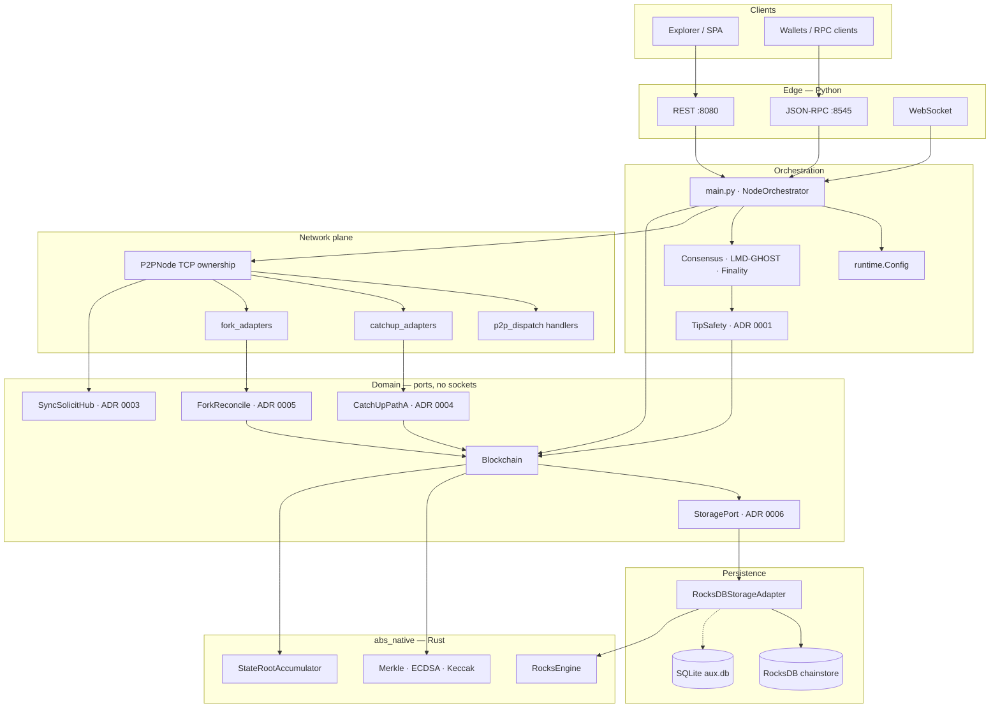
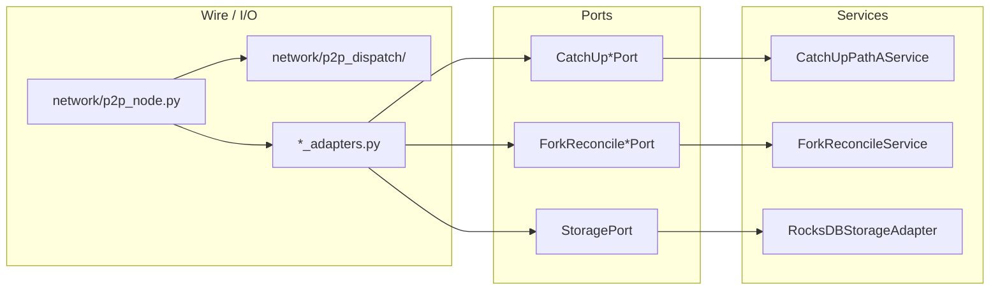
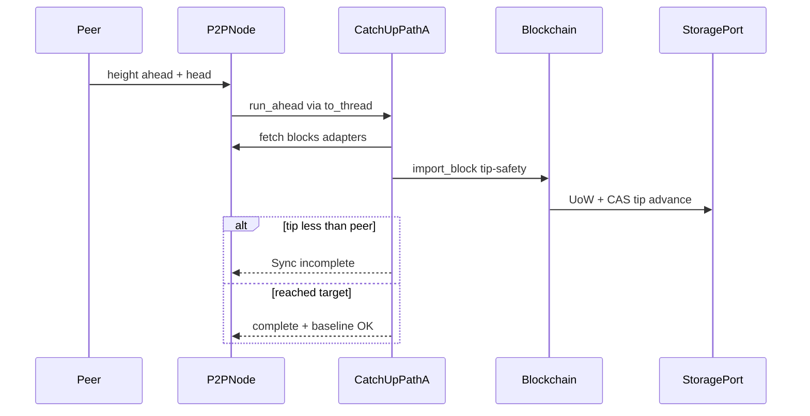
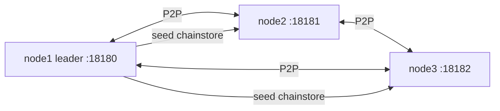

# Architecture (honest overview)

**Updated:** 2026-07-29  
**Scope:** Absolute Blockchain Ultimate Hybrid — domain ports + adapters (ADR 0001–0006). Devnet + mainnet-v1 **prep**, not a launched public mainnet.

---

## One-line summary

**Python** owns orchestration (API, P2P TCP, consensus policy). **Domain services** (`sync/`, `storage/`) own catch-up, fork reconcile, and persistence behind ports. **Rust/PyO3** (`abs_native`) accelerates crypto, state roots, RocksDB engine, and EVM kernels. **Prod** hot path = RocksDB; SQLite remains aux / dev.

---

## System map


```mermaid
flowchart TB
  subgraph clients ["Clients"]
    EX["Explorer / SPA"]
    W["Wallets / RPC clients"]
  end

  subgraph edge ["Edge — Python"]
    REST["REST :8080"]
    JR["JSON-RPC :8545"]
    WS["WebSocket"]
  end

  subgraph orch ["Orchestration"]
    MAIN["main.py · NodeOrchestrator"]
    CFG["runtime.Config"]
    CONS["Consensus · LMD-GHOST · Finality"]
    TIP["TipSafety · ADR 0001"]
  end

  subgraph net ["Network plane"]
    P2P["P2PNode TCP ownership"]
    DISP["p2p_dispatch handlers"]
    CA["catchup_adapters"]
    FA["fork_adapters"]
  end

  subgraph domain ["Domain — ports, no sockets"]
    CAP["CatchUpPathA · ADR 0004"]
    FORK["ForkReconcile · ADR 0005"]
    SOL["SyncSolicitHub · ADR 0003"]
    BC["Blockchain"]
    SP["StoragePort · ADR 0006"]
  end

  subgraph persist ["Persistence"]
    AD["RocksDBStorageAdapter"]
    ROCKS[("RocksDB chainstore")]
    AUX[("SQLite aux.db")]
  end

  subgraph rust ["abs_native — Rust"]
    CRYPTO["Merkle · ECDSA · Keccak"]
    SR["StateRootAccumulator"]
    RE["RocksEngine"]
  end

  EX --> REST
  W --> JR
  REST --> MAIN
  JR --> MAIN
  WS --> MAIN
  MAIN --> CFG
  MAIN --> CONS
  MAIN --> P2P
  MAIN --> BC
  CONS --> TIP
  P2P --> DISP
  P2P --> CA
  P2P --> FA
  CA --> CAP
  FA --> FORK
  P2P --> SOL
  CAP --> BC
  FORK --> BC
  BC --> SP
  SP --> AD
  AD --> ROCKS
  AD -.-> AUX
  BC --> CRYPTO
  BC --> SR
  AD --> RE
  TIP --> BC
```

Solid = **prod-relevant hot path**. Dotted = **aux / cold / optional**.

---

## Domain isolation (ADR stack)


```mermaid
flowchart LR
  subgraph wire ["Wire / I/O"]
    TCP["network/p2p_node.py"]
    DISP2["network/p2p_dispatch/"]
    ADAPT["*_adapters.py"]
  end

  subgraph ports ["Ports"]
    CP["CatchUp*Port"]
    FP["ForkReconcile*Port"]
    STP["StoragePort"]
  end

  subgraph svc ["Services"]
    A["CatchUpPathAService"]
    F["ForkReconcileService"]
    S["RocksDBStorageAdapter"]
  end

  TCP --> DISP2
  TCP --> ADAPT
  ADAPT --> CP
  ADAPT --> FP
  ADAPT --> STP
  CP --> A
  FP --> F
  STP --> S
```

| ADR | Boundary | What moved out of P2P / Blockchain |
|-----|----------|-------------------------------------|
| [0001](adr/0001-tip-safety.md) | TipSafety | Import refuse before tip/finality greenwash |
| [0002](adr/0002-p2p-transport-boundary.md) | Transport | Native frame / TLS policy at the edge |
| [0003](adr/0003-sync-consistency.md) | Solicit hub | Unsolicited `state_root` / blocks honesty |
| [0004](adr/0004-catchup-path-a.md) | Catch-up Path A | Ahead batch loop + `Sync incomplete` |
| [0005](adr/0005-fork-reconcile.md) | Fork / GHOST | Same-height reorg + fail-closed Evidence |
| [0006](adr/0006-storage-boundary.md) | StoragePort | Canonical UoW; `Blockchain` on `self.storage` |

---

## Repo layout (where to look)

```text
main.py                 boot · wires storage + sync engines
api/                    REST + JSON-RPC + Explorer glue
network/
  p2p_node.py           TCP + thin sync/fork wires
  p2p_dispatch/         status / unsolicited / solicit handlers
  catchup_adapters.py   P2P → CatchUp ports
  fork_adapters.py      P2P → ForkReconcile ports
sync/
  catchup/              Path A service + types
  fork/                 ForkReconcileService + policy
  solicit.py            SyncSolicitHub
core/blockchain.py      domain apply · StoragePort only
storage/
  ports.py              StoragePort / UoW contracts
  adapters/             RocksDBStorageAdapter
  factory.py            open_storage(db)
native/abs_native/      Rust crypto · Rocks · EVM kernels
consensus/              LMD-GHOST + finality policy
runtime/                Config · prod smoke profile
docs/adr/               boundary decisions 0001–0006
scripts/                industrial_gate · mesh · soak
```

---

## What runs where

| Component | Language | Prod (778888 prep) | Dev (77777) |
|-----------|----------|-------------------|-------------|
| REST / RPC / WS | Python | Yes | Yes |
| P2P TCP + dispatch | Python | Yes | Yes |
| Catch-up / fork services | Python domain | Yes | Yes |
| Consensus policy | Python | Unified LMD-GHOST | Parallel/auto |
| TipSafety enforce | Python | **Required** | Optional |
| Blockchain domain | Python → StoragePort | Yes | Yes |
| State root / hashing | Rust PyO3 | Required | Required |
| Chain storage hot path | RocksDB via adapter | **Required** | SQLite default |
| Bridge L1 | Rust binary | **Off** until cutover | Optional |
| Lightning / Plasma / WASM / AI | Python modules | Blocked / aux | Enabled in dev |

---

## Sync & storage honesty (short)


```mermaid
sequenceDiagram
  participant Peer
  participant P2P as P2PNode
  participant PathA as CatchUpPathA
  participant BC as Blockchain
  participant Store as StoragePort

  Peer->>P2P: height ahead + head
  P2P->>PathA: run_ahead via to_thread
  PathA->>P2P: fetch blocks adapters
  PathA->>BC: import_block tip-safety
  BC->>Store: UoW + CAS tip advance
  alt tip less than peer
    PathA-->>P2P: Sync incomplete
  else reached target
    PathA-->>P2P: complete + baseline OK
  end
```

---

## Multi-node deployment


```mermaid
flowchart LR
  N1["node1 leader :18180"]
  N2["node2 :18181"]
  N3["node3 :18182"]
  N1 <-- P2P --> N2
  N2 <-- P2P --> N3
  N1 <-- P2P --> N3
  N1 -->|seed chainstore| N2
  N1 -->|seed chainstore| N3
```

Prod mesh: `scripts/docker_prod_3node.ps1` · probe: `scripts/probe_mesh_nodes.ps1 -ProdMesh`

---

## Storage layout (prod)

See [STORAGE_ROCKSDB.md](STORAGE_ROCKSDB.md).

```
data/
  chainstore/     # RocksDB: blocks, accounts, txs, bridge, NFT marketplace, evm_logs
    aux.db        # SQLite sidecar: lightning/plasma/wasm/oracles and other cold modules
```

Domain code talks **StoragePort** only; engine unwrap remains for Wave-G API/P2P compat (`bc.db`).

Backup: `scripts/backup_chainstore.ps1 -DockerMesh1` · DR: `scripts/dr_restore_rehearsal.ps1`

---

## Quality gates

| Gate | Where |
|------|--------|
| CI pytest + native build | `.github/workflows/test.yml` |
| Docker prod image | `.github/workflows/docker-prod-image.yml` |
| Dependency audit | `.github/workflows/security-audit.yml` |
| Local full gate | `scripts/check_hybrid_full.ps1` |
| Industrial / needle honesty | `scripts/industrial_gate.py` |
| Prod profile enforcement | `scripts/prod_gate.py` |
| State consistency | `GET /chain/consistency/harness` |

---

## Related docs

- [EVIDENCE_MATRIX.md](EVIDENCE_MATRIX.md)
- [PORTING_ROADMAP.md](PORTING_ROADMAP.md)
- [MAINNET_GAP_ANALYSIS.md](MAINNET_GAP_ANALYSIS.md)
- [STORAGE_ROCKSDB.md](STORAGE_ROCKSDB.md)
- [PUBLIC_TESTNET.md](PUBLIC_TESTNET.md)
- [DOCKER_IMAGES.md](DOCKER_IMAGES.md)
